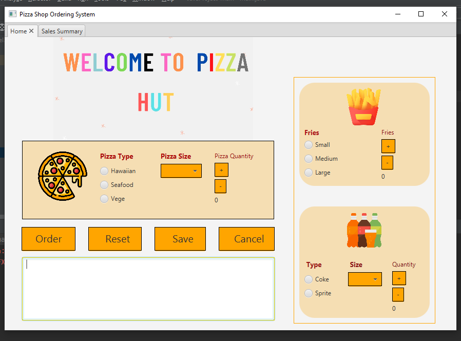
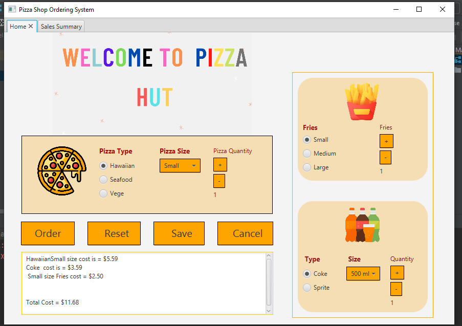
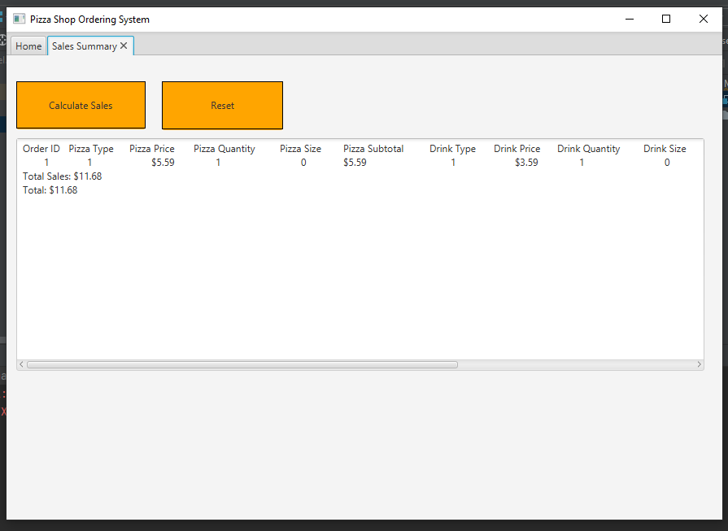
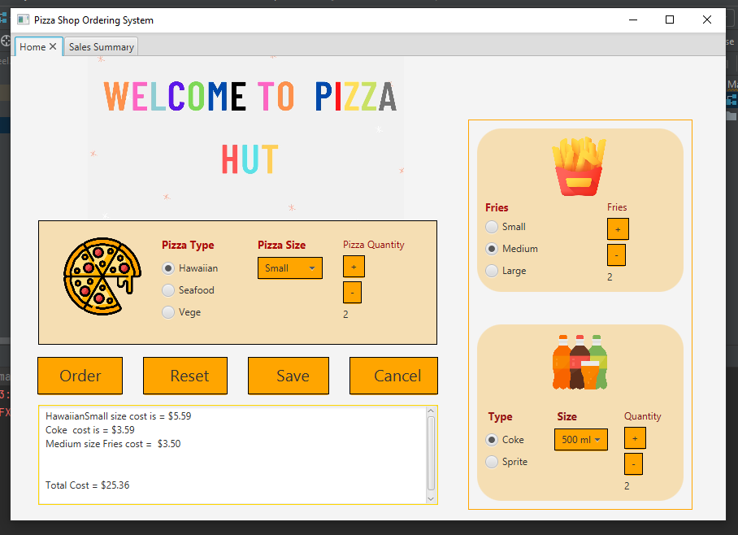
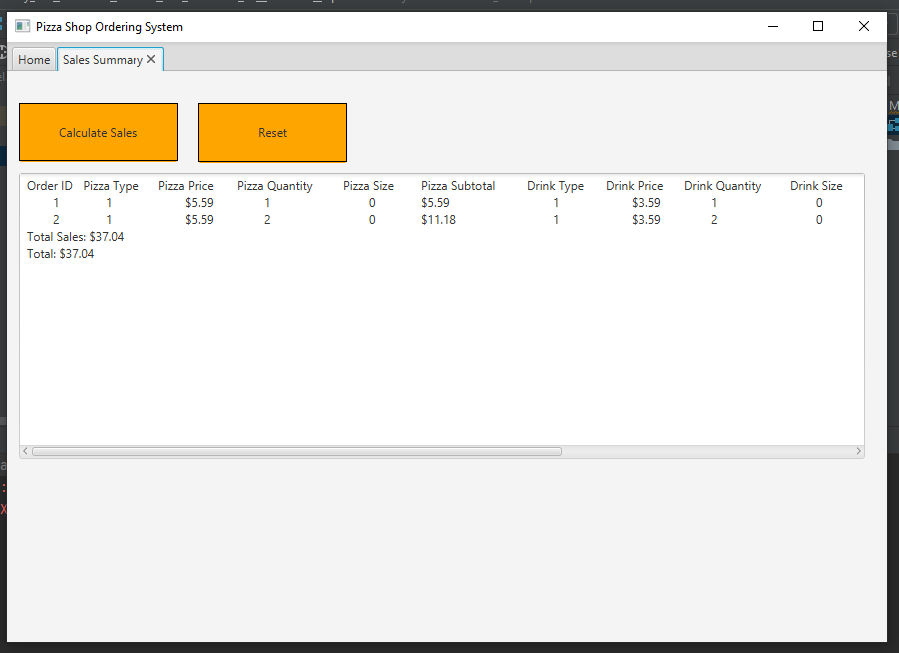

<h2> Pizza shop Ordering System </h2> 

<h3> Description: </h3>
This app is created in Java programming language. For the GUI we have used Scene Builder and JavaFX library. Moreover, it uses MySQL to save the order list in the database.

<h3> Software Requirements: </h3>
<h4>JavaFX SDK 11.0.2 -  https://openjfx.io/  
Scene Builder 11.0.0 - https://gluonhq.com/products/scene-builder/  
IntelliJ IDEA - https://www.jetbrains.com/idea/  
Instruction to set up - https://openjfx.io/openjfx/docs/#introduction   
For VM options: --module-path ${PATH_TO_JAVAFX} --add-modules javafx.controls,javafx.fxml ;${PATH_TO_JAVAFX} - path to JavaFX library  
Mariadb connector which in the requirements folder.</h4>

<h3> Functions: </h3>
It is a pizza shop order management system that takes order from the user and save the order history in the database. Furthermore, it can also calculate the overall sales using the orders which have been saved in the database.  

<h3> App Screenshots: </h3>

<h3> List of completed features </h3>

<ul>
  <li> Can order different kind of pizza of different sizes ( small, medium and large option availiable)</li>
  <li> User can order fries as well( small, medium and large option available )</li>
  <li> User can also order drinks, coke and sprite options available ( 500ml or 1.5l )</li>
  <li> Order button will display the total oders and their cost in the output box</li>
  <li> Reset Button will reset all the orders </li>
  <li> Save Button save the data in the database</li>
  <li> On the Sales Summary, The out put box shows all the sales that had been done </li>
  <li> Calculate Sales button calculates all the sales </li>
  <li> Reset Button reset all the saves sales</li>
</ul>

<h1>List of features yet to implement</h1>
<ul>
  <li> The database is visible to everyone, It can be visible to only admins/staff. It can be done through creating login systems for customers and adim separately</li>
  <li> More food items can be added as well</li>
  <li> Adress/seat number of the customer can also be added, to deliver food in the restaurant </li>
  
</ul>

